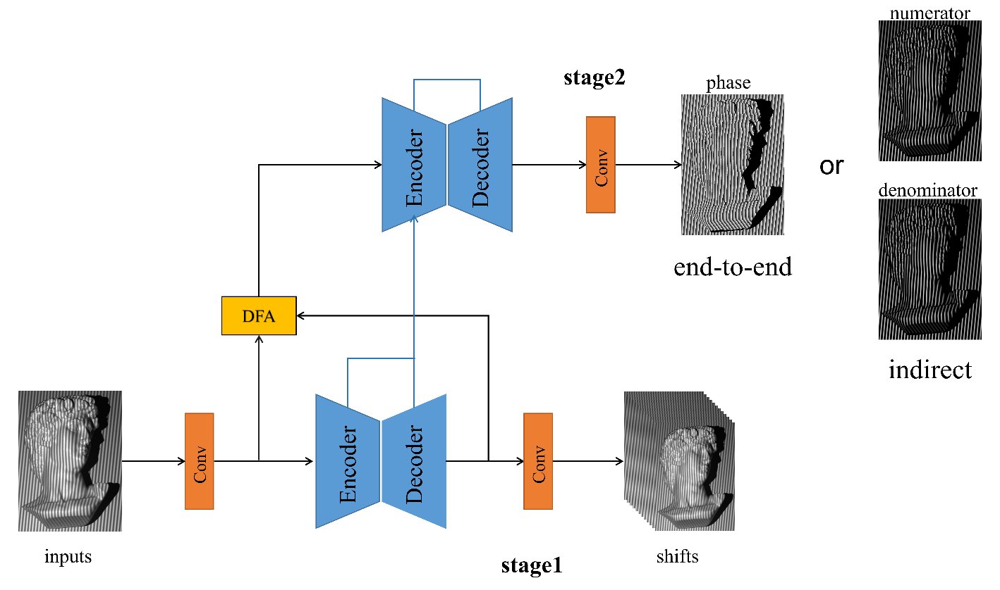

# PSTS-Net: Phase-shifting guided two-stage convolutional network for phase demodulation

## 1、Dataset
### Pure-Phase

### Blended-Phase

### Download
Download images from [here](https://www.google.com.).

The zip file contains the following files:

+ train:
  + Train dataset. This folder contains 8058 sets of data in total, of which 1-5095 sets are ideal conditions and 5096-8058 sets are non-ideal conditions.
  
+ val:
  + Val dataset. This folder contains 2000 sets of data in total, of which 1-1200 sets are ideal conditions and 1201-2000 sets are non-ideal conditions.

   
## 2、PSTS-Net
### Network Architecture

### Evaluation
Evaluation code and pre-training weights are provided in Evaluation  directory.
## 3、Citation
If you use PHASE or TSPPNet please consider citing:
